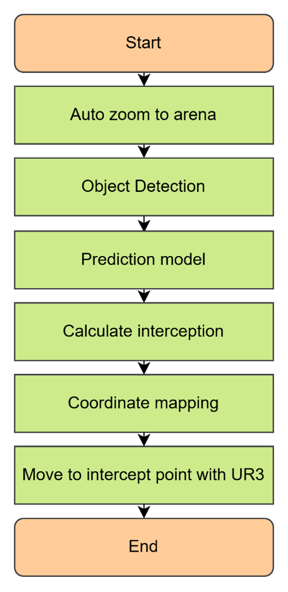
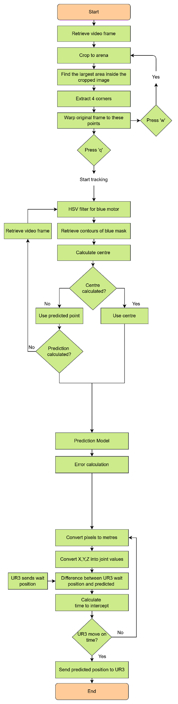

# Hexapod Robot Object Interception System

[](https://opensource.org/licenses/Apache-2.0)
[](https://www.python.org/downloads/)
[](https://pytorch.org/)

A real‑time interception system that tracks a moving hexapod robot (or any blue target) with a camera, predicts its future trajectory using Kalman filters, LSTMs, or Transformers, and commands a UR3e robotic arm to intercept it.



## Table of Contents
- [Overview](#overview)
- [Features](#features)
- [Hardware Requirements](#hardware-requirements)
- [Software Architecture](#software-architecture)
- [Installation](#installation)
- [Configuration](#configuration)
- [Usage](#usage)
- [Training Your Own Models](#training-your-own-models)
- [Robot Setup](#robot-setup)
- [Troubleshooting](#troubleshooting)
- [Publication](#publication)
- [Contributing](#contributing)
- [License](#license)

## Overview

The system processes live video from a webcam, extracts the blue object (the target), predicts its path using a chosen model, computes an intercept point that the UR3e arm can reach in time (using inverse kinematics and motion time estimation), and sends the arm to that point. The target hexapod is controlled separately via its Arduino firmware, allowing for dynamic testing.

**Key Performance Highlights (from experimental evaluation):**
- **Transformer** achieved the highest interception success rate of **93.3%** and the lowest mean trajectory error of **6.6 mm**.
- **LSTM** reached **86.7%** success and **9.7 mm** error.
- Classical methods (Kalman Filter and Linear) achieved **73.3%** and **80.0%** success respectively, struggling with rapid direction changes.
- The system operated in real time with a mean loop time of **29.0 ms**, well within the **39.65 ms** frame period.

## Features

- **Multiple Prediction Models**
  - Kalman Filter (constant velocity)
  - LSTM (sequence‑to‑sequence)
  - Transformer (self‑attention)
  - Linear (velocity smoothing)
- **Real‑Time Vision**
  - HSV colour filtering (blue) with histogram equalisation on the value channel
  - Morphological cleaning and contour detection
  - Perspective warp to arena coordinates using red tape detection
- **Robotic Control**
  - XML‑RPC communication with UR3e
  - Custom analytical inverse kinematics (IGM) with collision avoidance
  - Latency measurement and compensation (measured at **63.6 ms** mean command latency)
  - Automatic selection of fastest joint solution using trapezoidal velocity profiles
- **Visual Feedback**
  - Live video with overlay of predicted path, intercept point, and FPS
- **Simulation Mode**
  - Run on recorded videos without hardware
- **Data Augmentation**
  - Geometric mirroring and Gaussian noise injection for robust model training

## Hardware Requirements

| Component | Details |
|-----------|---------|
| **Robotic Arm** | Universal Robots UR3e (6 DOF) with XML‑RPC interface |
| **Target** | DFRobot InsectBot Mini MKII hexapod (or any blue‑colored object) |
| **Camera** | 1080p webcam operating at **25.22 FPS** with manual exposure/white balance |
| **Workspace** | Arena size: **470 mm × 120 mm** with red tape boundary |
| **Compute** | PC with Python 3.8+, OpenCV, PyTorch (CUDA optional) |
| **Network** | Ethernet or Wi‑Fi for UR3e communication (XML‑RPC over HTTP) |

## Software Architecture

### High‑Level Flowchart


### Low‑Level Flowchart



### Processing Pipeline

1. **Tracking** – Extracts blue object coordinates using HSV filtering (H: 90–130, S: 65–250, V: 35–250) with histogram equalisation and morphological closing.
2. **Prediction** – One of four models (Kalman, LSTM, Transformer, Linear) forecasts the target’s future path up to **150 frames** (~5.95 seconds).
3. **Interception Planner** – Iterates over predicted points, checks feasibility via analytical inverse kinematics and robot motion time (trapezoidal profile), and selects the best reachable intercept point.
4. **Robot Interface** – Sends the final pose to the UR3e via XML‑RPC and monitors execution with measured latency compensation.

## Installation

1. **Clone the repository:**
   ```bash
   git clone https://github.com/yourusername/hexapod-interception.git
   cd hexapod-interception
   ```

2. **Create a virtual environment (recommended):**
   ```bash
   python -m venv venv
   # Windows
   venv\Scripts\activate
   # Linux/macOS
   source venv/bin/activate
   ```

3. **Install dependencies:**
   ```bash
   pip install -r requirements.txt
   ```

   If you plan to use GPU acceleration for AI models, install PyTorch with CUDA support following the [official instructions](https://pytorch.org/get-started/locally/).

## Configuration

All tunable parameters are defined at the top of `src/hexapod_intercept/interception.py`. Key settings include:

| Parameter | Description |
|-----------|-------------|
| `WIDTH`, `HEIGHT` | Camera resolution (1280 × 720 pixels). |
| `BALL_RADIUS` | Radius of the target marker (for visualisation). |
| `SIMULATION` | `0` = use live camera, `1` = use video file. |
| `SEND_XMLRPC` | `1` to send commands to UR3e, `0` for testing. |
| `FILTER` | `"blue"` for blue target; other values use a generic threshold. |
| `LSTM`, `TRANSFORMER`, `KALMANFILTER`, `LINEARMODEL` | Select which prediction model to use. Only one should be `1`. |
| `PREDICTION_LENGTH` | Number of future frames to predict (default: 150). |
| `HISTORY_LENGTH` | Input window size for LSTM/Transformer (default: 60 frames, ~2.38 seconds). |
| `GRAD_THRESH` | Error gradient threshold to trigger interception search (default: 0.5). |
| `FPS`, `dt` | Frame rate (25.22 FPS) and time step for Kalman filter. |
| `MIN_TIME`, `MAX_TIME` | Acceptable time window (seconds) for robot arrival. |
| `REST_ANGLE` | Default joint angles of the UR3e (obtained from robot). |
| `LINEAR_SMOOTH` | Number of frames for velocity averaging in linear model (default: 60). |
| `MAX_UNCERTAINTY` | Uncertainty threshold for Kalman filter predictions. |

**Important:** After changing the configuration, restart the script.

## Usage

### Real Robot Mode

1. Power on the UR3e and ensure it is connected to the same network as the PC.
2. Start the PolyScope program that exposes the XML‑RPC server (see [Robot Setup](#robot-setup)).
3. Run the main script:
   ```bash
   python src/hexapod_intercept/interception.py
   ```
4. A window will appear showing the camera feed. 
   - Press **`W`** to compute the arena perspective transform (must see the red tape).
   - Press **`Q`** to start tracking and interception.
5. The system will automatically detect the blue target, predict, and send intercept poses to the robot.

### Simulation Mode (Video)

If you want to test without a robot or camera, set `SIMULATION = 1` and point `VIDEO_PATH` to a video file. The system will run as if it were live, but will not send commands to the robot (unless `SEND_XMLRPC` is also set).

```bash
# Edit the config file or parameters to enable simulation
python src/hexapod_intercept/interception.py
```

### Recording Output

Set `SAVE_VIDEO = 1` and specify `OUTPUT_PATH` to save the annotated video.

## Training Your Own Models

### Data Preparation

1. Record videos of the target moving in the arena (e.g., the hexapod walking).
2. Use the data preprocessing script `traindata.py` (provided in the repo) to extract the object positions from the videos.
3. The script will generate `.pt` files containing sequences of positions, velocities, and accelerations, divided into training and test sets.
4. Data augmentation includes geometric mirroring (x-axis, y-axis, both) and Gaussian noise injection (5% of feature standard deviation) to improve model generalisation.

### LSTM Training

Run:
```bash
python src/hexapod_intercept/LSTM_Train.py
```
This will train an LSTM model on the dataset and save the weights to `models/LSTM.pth`.

### Transformer Training

Run:
```bash
python src/hexapod_intercept/Transformer_Train.py
```
This trains the Transformer model and saves weights to `models/Transformer.pth`.

After training, ensure the normalisation statistics are saved (the scripts do this automatically). The main script will use these to normalise inputs and outputs.

## Robot Setup

### UR3e PolyScope Program

You need to create an XML‑RPC server on the UR3e. The PC acts as the client. The main functions used are:

- `handshake()` – called by the robot upon connection.
- `get_next_pose(original_pose)` – called by the robot when it is ready for a new target pose. Returns a pose dictionary.
- `set_robot_moving(moving)` – called by the robot to inform the PC when motion starts/stops.
- `send_angle(angles)` – called by the robot to send its current joint angles.
- `calibrate_latency()` – called by the robot to measure command latency.

The PC script `SendRobotXML.py` implements the server. The robot must call these functions appropriately. Refer to the UR script examples in the PolyScope manual.

### Arduino Hexapod Firmware

The `insectbot_hexa.ino` file is uploaded to the InsectBot's Arduino board. It controls the hexapod's servos and includes basic light‑seeking and obstacle avoidance behaviours. For interception tests, you can drive the hexapod manually or let it wander while the UR3e intercepts it.

## Troubleshooting

| Issue | Likely Cause | Solution |
|-------|--------------|----------|
| **Robot not receiving poses** | XML‑RPC server not running on PC, or IP/port mismatch. | Verify UR3e can ping the PC; check firewall settings. |
| **No blue object detected** | Lighting conditions, HSV thresholds wrong. | Adjust `lower_blue`/`upper_blue` in `Tracking.py` or use the debug mask (`DEBUG=1`). |
| **No intercept point found** | Predicted path too short, robot cannot reach within `MIN_TIME`. | Increase `PREDICTION_LENGTH` or lower `MIN_TIME`. |
| **LSTM/Transformer model not loaded** | Missing model files or path mismatch. | Check `models/` folder and paths in `Prediction.py`. |
| **High prediction error** | Model not trained for current motion pattern. | Collect more training data or adjust model hyperparameters. |
| **Camera frame drop** | High resolution or FPS too high. | Reduce `WIDTH`/`HEIGHT` or `FPS`. |
| **Occlusion of blue motor housing** | Insectbot's head blocks the blue housing during vertical approaches. | Use `OCCLUSIONS=1` to fall back to predicted positions. |

## Publication

This work has been published in the **Journal of SETU Engineering Proceedings (JSEP)**.

**Reference:**
> Byrne, William. (2026) ‘Real-Time Moving Object Trajectory Prediction and Interception’, *Journal of SETU Engineering Proceedings*, Issue 1, pp. 37–38. doi: [10.83373/PE89-4D81](https://doi.org/10.83373/PE89-4D81). eISSN: 3088-7100.

**In-text citation:** (Byrne, 2026)

## Contributing

Contributions are welcome! Please read [CONTRIBUTING.md](CONTRIBUTING.md) for guidelines on how to submit issues, feature requests, and pull requests.

## License

This project is licensed under the Apache License, Version 2.0 – see the [LICENSE](LICENSE) file for details.

```
Copyright 2025 William Byrne

Licensed under the Apache License, Version 2.0 (the "License");
you may not use this file except in compliance with the License.
You may obtain a copy of the License at

    http://www.apache.org/licenses/LICENSE-2.0

Unless required by applicable law or agreed to in writing, software
distributed under the License is distributed on an "AS IS" BASIS,
WITHOUT WARRANTIES OR CONDITIONS OF ANY KIND, either express or implied.
See the License for the specific language governing permissions and
limitations under the License.
```

## Acknowledgments
- [Lumi](http://www.dfrobot.com) for the InsectBot Mini MKII design.
- Universal Robots for the UR3e SDK and documentation.
- The PyTorch and OpenCV communities for their excellent libraries.
- Supervisors and faculty at South East Technological University for their guidance and support.
```
